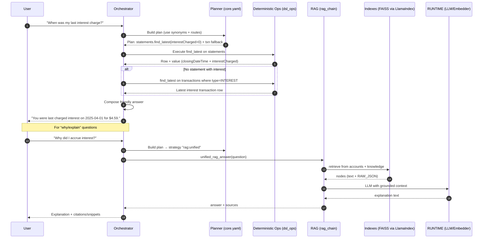

# Agent Desktop Assist — End‑to‑End Guide

> Hybrid factual + explanatory answers for card accounts using a deterministic DSL and Retrieval‑Augmented Generation (RAG).

---

## Table of Contents
- [Overview](#overview)
- [Architecture](#architecture)
- [Components](#components)
  - [Index Builder](#1-index_builderpy--ingestion--vector-indexes)
  - [Domain Loaders](#2-domain-loaders-thin-adapters)
  - [Planner (core.yaml)](#3-coreyaml-planner-rules)
  - [Deterministic Engine (dsl_ops.py)](#4-deterministic-engine--dsl_opspy)
  - [RAG Path (rag_chain.py)](#5-rag-path--rag_chainpy)
  - [Orchestrator / Compose](#6-orchestrator--compose)
  - [Runtime Singletons](#7-runtime-singletons)
- [End-to-end Request Flow](#end-to-end-request-flow)
- [Design Choices & Trade-offs](#design-choices--trade-offs)
- [How to Extend](#how-to-extend)
- [What’s in Each Index Folder](#whats-in-each-index-folder)
- [Quickstart](#quickstart)
- [FAQ](#faq)

---

## Overview

This project answers card‑account questions with a **hybrid approach**:

- **Deterministic engine (DSL)** for factual, auditable questions (e.g., _“When was my last payment?”_).
- **RAG (retrieval‑augmented generation)** for explanatory/policy questions (e.g., _“Why did I accrue interest?”_).

Both paths share the same data and indexes, and the **planner** picks the right path per question.

---

## Architecture

```mermaid
flowchart LR
  subgraph Ingestion & Indexing
    A1[customer_data/<account_id>/\\ntransactions.json\\npayments.json\\nstatements.json\\naccount_summary.json]
    A2[data/knowledge/\\nhandbook.md, PDFs...]
    B1[index_builder.py\\n- render rows to text\\n- add rich metadata\\n- append RAW_JSON\\n- build FAISS]
    A1 --> B1
    A2 --> B1
    B1 --> I1[(FAISS + stores)\\nindexesstore/accounts/<id>/llama]
    B1 --> I2[(FAISS + stores)\\nindexesstore/knowledge/llama]
  end

  subgraph Runtime
    P1[core.yaml\\nplanner rules\\nroutes + synonyms]
    E1[dsl_ops.py\\n(get_field, find_latest,\\nlist_where, sum_where, ...)]
    O1[orchestrator\\n(plan -> execute -> compose)]
    R1[rag_chain.py\\n(LI retrieve +\\nLLM synthesize)]
    L1[RUNTIME\\n- config\\n- LLM client\\n- embedder\\n- memory]
  end

  Q[User question] --> O1
  O1 --> P1
  P1 -- "deterministic plan" --> E1
  P1 -- "rag:unified plan" --> R1
  E1 <-- domain loaders --> D[(domain data providers)]
  R1 --> I1
  R1 --> I2
  E1 --> O1
  R1 --> O1
  L1 -. used by .-> R1
  O1 --> A[Answer + sources]
```

---

## Components

### 1) `index_builder.py` — ingestion & vector indexes

**What it does**
- Reads four account JSON domains (`transactions`, `payments`, `statements`, `account_summary`) plus knowledge files (handbook, PDFs, txt).
- Renders each **row** into a compact **natural text line** (high‑signal fields first) and **appends the full RAW_JSON** for auditability.
- Enriches **metadata** per row (timestamps, merchant/category, interest flags, etc.).
- Builds **FAISS** vector stores and persists all artifacts under:
  - `src/api/contextApp/indexesstore/accounts/<account_id>/llama`
  - `src/api/contextApp/indexesstore/knowledge/llama`

**Why we chose this**
- **Single‑row granularity** → targeted, explainable retrieval.
- **Text + RAW_JSON** → strong retrieval signal with full fidelity for audit.
- **FAISS** → fast, local, portable. 
- **LlamaIndex** → clean doc→embedding→store pipeline with persistence.

**Tech behind it**
- **Embedding model**: HuggingFace `sentence-transformers/all-MiniLM-L6-v2` by default (local, no key). You can swap to hosted embeddings via `RUNTIME.embedding()`.
- **FAISS**: `IndexFlatIP` for cosine‑like similarity (with normalized vectors); LlamaIndex manages `index_store.json`/`docstore.json`.

---

### 2) Domain loaders (thin adapters)

**What they do**
- Load rows from local JSON (or from APIs later) and return Python dicts/lists.

**Why**
- Clean separation makes it trivial to switch local→remote without touching planner/ops.

---

### 3) `core.yaml` (planner rules)

**What it does**
- Maps **natural language** to:
  - **Deterministic capabilities** (`find_latest`, `get_field`, `list_where`, `sum_where`, …).
  - **RAG strategy** (`rag:unified`) for “why/explain/policy”.
- Contains **synonyms** (e.g., “last/latest/recent”) and **routing rules** (e.g., “for last interest charge: prefer statements with `interestCharged>0`; else fallback to interest transactions”).

**Why**
- Keeps “what to do” in **data/config**, not code.
- Easy to audit and extend (add routes/synonyms without redeploying Python).

**Tech**
- Simple YAML, consumed by your planner LLM prompt as a constrained schema.

---

### 4) Deterministic engine — `dsl_ops.py`

**What it does**
- Implements small, predictable operators:
  - `get_field` – pull exact fields (supports dotted paths and computed expressions).
  - `find_latest` – sort by a timestamp key (with sensible fallbacks) and pick row 0.
  - `list_where` – filter/sort/paginate lists; supports `period` symbols (LAST_MONTH, THIS_YEAR, etc.), merchant/category like, min/max amounts, etc.
  - `sum_where`, `topk_by_sum`, `compare_periods`, `semantic_search` (keyword fallback).
  - `explain_interest` – deterministic scaffold that pulls the latest statement window and aggregates relevant purchases/payments/interest txns for a clear “why”.

**Why**
- **Auditability** and **correctness** for factual Q&A (dates, amounts).
- **Time semantics** are explicit: “last/latest” is always a **sort & pick** by real timestamps, not LLM guesswork.

**Tech**
- Pure Python; ISO‑8601 parsing; period math; strict filters; no hidden AI.

---

### 5) RAG path — `rag_chain.py`

**What it does**
- Uses **LlamaIndex** only for retrieval (vector store load + `.retrieve()`).
- **Merges** account + knowledge nodes (prefers account).
- Builds a compact **context block** and calls the runtime **LLM** with a **grounding instruction**: _answer only from this context; otherwise say “I don’t know from the provided context.”_
- Returns answer + structured **sources** (file hints + snippets).

**Why**
- Explanations often require blending **policy text (handbook)** + **account evidence**; RAG excels here.
- Avoids brittle library adapters by calling the LLM directly after retrieval.

**Tech**
- LlamaIndex StorageContext + FaissVectorStore (`from_persist_dir`).
- Any OpenAI‑compatible chat model via `RUNTIME.chat()`.

---

### 6) Orchestrator / Compose

**What it does**
- **Orchestrator** runs the plan: routes to deterministic ops or to RAG, collects results.
- **Composer** renders a human‑friendly answer (e.g., `$` formatting, normalized dates).
- Special‑cases certain routes for better UX (payments+`find_latest` → say amount + date).

**Why**
- Separation of concerns:
  - Planner decides _what_ to do.
  - Ops produce _facts/payloads_.
  - Composer turns them into _clear language_.

---

### 7) Runtime singletons

**What it does**
- Provides the **LLM client**, **embedding model**, **config**, and **conversation memory**.
- One place to swap OpenAI vs. local models, implement rate‑limits, etc.

---

## End-to-end Request Flow



---

## Design Choices & Trade-offs

- **FAISS + LlamaIndex** over a managed vector DB  
  → zero infra, fast local dev, portable. Swap to Milvus/PGVector later without changing upper layers.

- **Local HF embeddings by default**  
  → no keys to start; reproducible. When you want higher recall/quality, switch to a hosted embedder via `RUNTIME.embedding()`.

- **Deterministic engine before LLM**  
  → prevents “model guessing” for **latest**/**sum**/**get field**. The LLM is reserved for *reasoning across text* (policy explanations), not arithmetic/date logic.

- **Text + RAW_JSON per row**  
  → strong retrieval signal and complete ground truth. Great for audit and “show your work”.

- **Planner in YAML**  
  → easy to version, review, and extend; separates product behavior from code.

- **Manual LI retrieval + direct LLM call**  
  → sidesteps adapter churn (e.g., `.as_langchain()` changes). It’s thin and robust.

---

## How to Extend

- **New deterministic question**  
  Add a route to `core.yaml` (domain/capability/args). If you need a new operator, implement it once in `dsl_ops.py`.

- **New explanation**  
  Route to `rag:unified` or add a small deterministic scaffold (like `explain_interest`) that prepares context before RAG.

- **New data source**  
  Implement a loader returning rows and plug it into the index builder & providers.

- **Improve retrieval quality**  
  Tweak the renderers in `index_builder.py` (add tags/fields), or switch the embedder.

---

## What’s in Each Index Folder

Each index folder (per account and for knowledge) contains the FAISS binary plus LlamaIndex stores (names vary slightly by LI version), typically:

```
faiss.index
index_store.json
docstore.json
default__vector_store.json
```

Do not hand‑edit; LlamaIndex manages these.

---

## Quickstart

1. **Prepare data**
   ```
   src/api/contextApp/customer_data/<account_id>/{transactions,payments,statements,account_summary}.json
   src/api/contextApp/data/knowledge/{handbook.md, *.pdf, *.txt}
   ```

2. **Build indexes**
   ```bash
   python -m core.retrieval.index_builder <account_id>
   # → writes to src/api/contextApp/indexesstore/{accounts/<id>/llama, knowledge/llama}
   ```

3. **Run the service** (example)
   ```
   uvicorn main:app --reload
   ```

4. **Ask questions**
   - Deterministic: “When was my last payment?”
   - RAG: “Why did I accrue interest?”

---

## FAQ

**Q: Why might “latest” be wrong?**  
A: We fixed this by making `find_latest` **always** sort by a strong date key with fallbacks, then composer renders the *right* fields (amount+date for payments; interest for statements).

**Q: Can I keep everything in one config file?**  
A: Yes—the planner rules already live in `core.yaml`. Indexing logic stays in code because it focuses on performance/data formatting.

**Q: Can I switch embeddings?**  
A: Yes—provide a different embedder via `RUNTIME.embedding()` (e.g., OpenAI text-embedding-3-large) and rebuild indexes.

---

Happy shipping!
