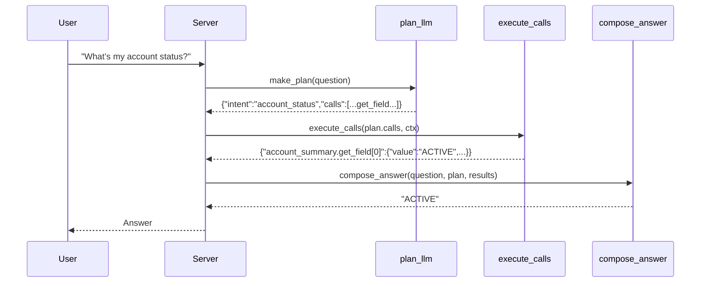

# Credit-Card Copilot

Production-ready overview of the **plan → execute → compose** architecture with **RAG** (retrieval-augmented generation) and **conversational memory**.

---

## 0) TL;DR

- **Planner LLM** turns a user question into a **strict JSON plan** (which tools to call).
- **Executor** runs either the **deterministic DSL** (direct JSON field/aggregate queries) or the **RAG lane** (semantic retrieval over account JSON + handbook/policy) with short-term memory.
- **Composer** renders heterogeneous results into a clean answer (tables, money/date formats, optional RAG sources).

---

## 1) High-Level Flow

```mermaid
flowchart LR
  A[User Question] --> B[plan_llm: Planner LLM]
  B -->|STRICT JSON plan| C[execute_calls: Executor]
  C -->|results dict| D[compose_answer: Presenter]
  D --> E[Final Answer]

  subgraph Structured Lane (DSL)
    C1[get_field / find_latest / sum_where / topk_by_sum / list_where / semantic_search]
  end

  subgraph RAG Lane (Conversational)
    R1[Account FAISS Index]
    R2[Knowledge FAISS Index]
    RC[ConversationalRetrievalChain + Memory]
  end

  C -->|domain_id != rag| C1
  C -->|domain_id == rag| RC
  RC --> R1
  RC --> R2
```

---

## 2) What the System Uses (and Why)

| Component | Library/Tech | Why we use it |
|---|---|---|
| Planner LLM | OpenAI-compatible `/chat/completions` (e.g., `gpt-4o-mini`) | Deterministic **routing**: emits strict JSON plans (no hallucinated calculations). |
| DSL (structured lane) | Pure Python | Ultra-fast, safe answers for direct data questions (no embeddings). |
| RAG (semantic lane) | **LlamaIndex + FAISS** (indexing) + **LangChain** (memory & conversational chain) | Easy ingestion/persistence to FAISS + robust conversational retrieval with short-term memory. |
| Vector store | **FAISS** | Local, fast, portable ANN retrieval; persists on disk (`indexesstore`). |
| Memory | LangChain `ConversationBufferWindowMemory(k=10)` | Keeps last 10 turns per session for follow-ups. |
| Embeddings | OpenAI `text-embedding-3-large` (default) | High-quality semantic search; **dim=3072** (important for FAISS). |

---

## 3) Repository Layout (key parts)

```
src/
  api/
    contextApp/
      core/
        orchestrator/
          plan_llm.py          # planner LLM (strict JSON)
          execute.py           # executor (DSL + RAG lanes)
          compose_answer.py    # final answer renderer
        retrieval/
          rag_chain.py         # LangChain convo chain + wrappers
          json_ingest.py       # account indexes (build/ensure/load/retriever)
          knowledge_ingest.py  # knowledge index (handbook + agreement)
      index/
        index_builder.py       # startup index build (account + knowledge)
      data/
        customer_data/
          <account_id>/
            transactions.json
            payments.json
            statements.json
            account_summary.json
        knowledge/
          handbook.md
          Apple-Card-Customer-Agreement.pdf
      indexesstore/
        accounts/<account_id>/llama/     # FAISS persists here
        knowledge/llama/                  # FAISS persists here
config/
  app.yaml
```

---

## 4) Data & Indexing

### Per-Account JSON (structured)

Each account folder holds four JSON files:

- `transactions.json` (list)
- `payments.json` (list)
- `statements.json` (list)
- `account_summary.json` (single dict)

**Used by**
- **DSL lane**: direct reads (no embeddings)
- **RAG lane**: ingested into FAISS for semantic retrieval

### Knowledge (unstructured)

- `data/knowledge/handbook.md`
- `data/knowledge/Apple-Card-Customer-Agreement.pdf`

**Used by**
- **RAG lane** only (policy/terms explanations)

### Index Persistence

- **Account indices** → `indexesstore/accounts/<account_id>/llama/`
- **Knowledge index** → `indexesstore/knowledge/llama/`

```mermaid
flowchart LR
  A[JSON / MD / PDF] --> P[Chunk & Metadata]
  P --> E[Embed (OpenAI)]
  E --> F[FAISS index]
  F --> D[Disk: indexesstore/...]
```

**Embedding dimension matters**

- `text-embedding-3-large` → **3072**  
- `text-embedding-3-small` → 1536

The FAISS index must be built with the same dimension as the embedder you’ll query with.

---

## 5) Startup: Build Indexes

At process start (or on a cron), build/refresh indexes:

```python
from src.api.contextApp.index.index_builder import ensure_all_indexes
from src.api.contextApp.domains.accounts import list_accounts  # returns [account_id, ...]

ensure_all_indexes(list_accounts())
```

- **Account index**: flattens the four JSONs to `Document` chunks with helpful metadata, embeds, and writes a FAISS store.
- **Knowledge index**: ingests `handbook.md` and `Apple-Card-Customer-Agreement.pdf`, embeds, persists to FAISS.

---

## 6) Planning (LLM Tool-Selection)

The planner receives the user question, a contract describing allowed tools, and a few examples.  
It returns **strict JSON**:

```json
{
  "intent": "account_status",
  "calls": [
    {"domain_id": "account_summary", "capability": "get_field",
     "args": {"account_id": "AID", "field": "accountStatus"}}
  ],
  "must_produce": [],
  "risk_if_missing": []
}
```

Other examples:

- **Aggregations (DSL):**
```json
{"domain_id":"transactions","capability":"topk_by_sum",
 "args":{"account_id":"AID","key_field":"merchantName","k":5,"where":{"transactionType":"DEBIT"}}}
```

- **RAG: unified (account + knowledge):**
```json
{"domain_id":"rag","capability":"unified_answer","args":{"account_id":"AID","k":6}}
```

**Routing rule of thumb**

- Direct field / precise aggregate → **DSL**
- Fuzzy “why/how/policy” → **RAG (unified_answer)**

---

## 7) Execution (Router)

The executor takes `plan["calls"]` and runs them sequentially.

### A) DSL ops (domain-agnostic)

- `get_field` — dotted-path getter (`persons[0].ownershipType`, `accountStatus`, `period`)
- `find_latest` — newest row by timestamp fields
- `sum_where` — filters + sum (`amount` by default)
- `topk_by_sum` — group by key & sum (e.g., top merchants)
- `list_where` — filtered list/table
- `semantic_search` — optional lightweight keyword ranker (or replace with FAISS query)

These ops work uniformly across **transactions, payments, statements, account_summary**.

### B) RAG (semantic conversation)

- **Retrievers**
  - `ensure_account_retriever(account_id)` → loads LlamaIndex + FAISS for account JSONs
  - `ensure_knowledge_retriever()` → loads LlamaIndex + FAISS for knowledge docs
- **Chain**
  - LangChain `ConversationalRetrievalChain` with `ConversationBufferWindowMemory(k=10)`
  - Typically wrapped as `unified_rag_answer(question, session_id, account_id)`

**Memory**

- Short-term memory of the **last 10 messages** per `session_id`, enabling natural follow-ups.

---

## 8) Composer (Answer Renderer)

Converts the **results dict** (a mix of DSL and/or RAG payloads) into clean text:

- Money formatted, dates normalized, small tables for lists, and concise source snippets for RAG.
- Falls back to “I couldn’t find anything for that.” when empty.

---

## 9) End-to-End Request (Sequence)



---

## 10) How LLM & Embeddings Are Used

### LLM (chat model)

- **Planner**: low-temperature, small model (e.g., `gpt-4o-mini`) emits strict JSON plans.
- **RAG synthesizer**: same model (or larger) used by LangChain’s ConversationalRetrievalChain to **summarize retrieved evidence**.  
  *LLM does not invent totals—DSL handles math directly.*

### Embeddings

- **Indexing**: Each JSON row (or chunk) is embedded once during startup and stored in FAISS.
- **Query time**: For RAG, the retriever embeds the question and performs ANN search; top-k chunks are passed to the LLM for synthesis.
- **Dimension**: Must match between index build & query (e.g., 3072 for `text-embedding-3-large`).

---

## 11) Configuration

`config/app.yaml` (example)

```yaml
llm:
  model: gpt-4o-mini
  api_base: https://api.openai.com/v1
  api_key_env: OPENAI_API_KEY

embeddings:
  provider: openai
  model: text-embedding-3-large     # dim=3072; keep consistent
  api_key_env: OPENAI_API_KEY

indexes:
  dir: indexesstore

data:
  accounts_dir: src/api/contextApp/data/customer_data
  knowledge_dir: src/api/contextApp/data/knowledge
```

**Environment**

- `OPENAI_API_KEY` must be set in your environment.
- If you change the embedding model, you **must rebuild** indexes.

---

## 12) Running Locally

1) **Install**
```bash
pip install -r requirements.txt
# Make sure you have:
# langchain>=0.2.*, langchain-openai, langchain-core
# llama-index-core>=0.10.*, llama-index-vector-stores-faiss
# faiss-cpu, httpx, pyyaml, pydantic>=2.0
```

2) **Set keys**
```bash
export OPENAI_API_KEY=sk-...
```

3) **Build indexes**
```bash
python -m src.api.contextApp.index.index_builder
```

4) **Call the pipeline**
```python
from core.orchestrator.plan_llm import make_plan
from core.orchestrator.execute import execute_calls
from core.orchestrator.compose_answer import compose_answer

question = "What's my account status?"
session_id = "sess-123"
account_id = "<your-account-id>"

plan = make_plan(question, "config/app.yaml")
results = execute_calls(
    plan.get("calls", []),
    {"app_yaml": "config/app.yaml",
     "session_id": session_id,
     "account_id": account_id,
     "question": question}
)
print(compose_answer(question, plan, results))
```

---

## 13) Example Questions

- **Direct field (DSL):**  
  “What’s my **account status**?” → `account_summary.get_field(field='accountStatus')`

- **Aggregation (DSL):**  
  “Top 5 merchants in the last 12 months” → `transactions.topk_by_sum(key_field='merchantName', where={'transactionType':'DEBIT'})`

- **Semantic (RAG):**  
  “Why was I charged interest last month?” → `rag.unified_answer(account_id=...)`

---

## 14) Troubleshooting

- **`invalid start byte` / JSON errors when loading index**  
  You may be trying to `json.load` a FAISS file or using the wrong persist directory. Always load with:
  ```python
  from llama_index.core import StorageContext, load_index_from_storage
  from llama_index.vector_stores.faiss import FaissVectorStore

  vector = FaissVectorStore.from_persist_dir(<dir>)
  storage = StorageContext.from_defaults(vector_store=vector, persist_dir=<dir>)
  index = load_index_from_storage(storage)
  ```

- **Embedding dimension mismatch**  
  If you change models (e.g., 1536 ↔ 3072), **delete `indexesstore` and rebuild**.

- **RAG chain import errors** (LangChain version drift)  
  Use `langchain_core.*` imports (or try/except shims) for `BaseRetriever`, `Document`, etc.

- **Old/Corrupt indexes after code changes**  
  Delete `indexesstore/*/llama` and rebuild.

---

## 15) Extending Safely

- Add new **DSL ops** (e.g., `average_per_month`) and expose them in the planner contract.
- Add new knowledge files to `data/knowledge/` and rerun the index builder.
- For multi-account requests, either:
  - Build a per-account index and call RAG per account; **or**
  - Build a cross-account FAISS index with `account_id` in metadata, then filter at retrieval.

---

## 16) Security & Privacy Notes

- All sensitive data stays local; FAISS persists to disk inside your project (`indexesstore`).
- If you need persistent conversation memory across processes/hosts, swap in Redis/file-based memory keyed by `session_id`.

---

## 17) Glossary

- **DSL lane** — Deterministic functions over JSON (no LLM needed).
- **RAG** — Retrieval-Augmented Generation; retrieve relevant chunks + LLM synthesis.
- **FAISS** — Facebook AI Similarity Search; vector ANN engine.
- **LlamaIndex** — Document → Node → Vector pipeline and persistence.
- **LangChain** — Conversational retrieval & memory orchestration.
